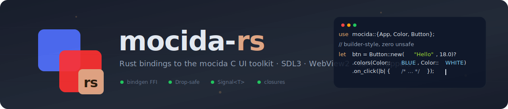
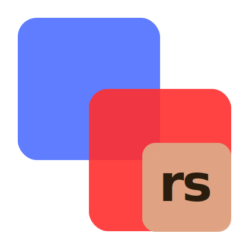

<p align="center">
  
</p>

# mocida-rs



Rust bindings for [Mocida](https://github.com/liy77/mocida), the C UI
toolkit built on SDL3 by [@liy77](https://github.com/liy77).

> This is **not a Rust reimplementation** of Mocida. It's an FFI layer:
> the C library does the rendering and event handling; Rust code calls
> into it through a safe, idiomatic wrapper.

Want to see it running? See [`EXAMPLES.md`](./EXAMPLES.md) for
step-by-step instructions to launch `hello_world`, `signals` and the
full `demo`.

## Layout

| Crate         | What it is                                                       |
| ------------- | ---------------------------------------------------------------- |
| `mocida-sys`  | Raw `extern "C"` bindings generated by `bindgen` at build time.  |
| `mocida`      | Safe wrapper with `Drop`-managed handles, builders, and enums.   |

## Prerequisites

1. A working Mocida build. Clone and build the C library following the
   instructions in the upstream
   [`README`](https://github.com/liy77/mocida/blob/master/README.md)
   (currently Windows 10/11 + MSVC + SDL3).
2. `clang` on `PATH` (used by `bindgen`).
3. Rust 1.74+.

## Building

Point the build at your Mocida install with two env vars:

```powershell
$env:MOCIDA_INCLUDE_DIR = "C:\path\to\mocida\src\headers"
$env:MOCIDA_LIB_DIR     = "C:\path\to\mocida\build"   # contains mocida.lib / mocida.dll
cargo build -p mocida
```

Optional knobs:

| Variable           | Purpose                                            | Default    |
| ------------------ | -------------------------------------------------- | ---------- |
| `MOCIDA_LIB_NAME`  | Base name passed to `-l`.                          | `mocida`   |
| `MOCIDA_STATIC`    | `1` to link statically.                            | dynamic    |
| `SDL3_INCLUDE_DIR` | Extra include path (with `--features sdl3-headers`).| —          |

The build script ships **opaque shims** for the SDL3 types referenced
in the public headers (`SDL_Surface`, `SDL_Scancode`, `Uint16`, ...)
so `bindgen` can run without SDL3 on disk. Enable
`--features sdl3-headers` and set `SDL3_INCLUDE_DIR` if you'd rather
expose the real SDL types.

## Hello world

```rust
use mocida::{App, Color, Rectangle, Text};

fn main() -> Result<(), Box<dyn std::error::Error>> {
    let mut app = App::new("Hello mocida-rs", 800, 600)?;
    app.set_background_color(Color::rgb(226, 232, 240));

    let panel = Rectangle::new()?
        .color(Color::WHITE)
        .radius(14.0)
        .into_widget_sized(752.0, 552.0)?
        .position(24.0, 24.0);

    let title = Text::new("Hello, Rust!", 28.0)?
        .color(Color::rgb(15, 23, 42))
        .into_widget()?
        .position(48.0, 44.0);

    let mut children = mocida::Children::new(4)?;
    children.add(panel)?;
    children.add(title)?;
    app.set_children(children);

    app.show().run();
    Ok(())
}
```

Run the bundled example:

```powershell
cargo run -p mocida --example hello_world
```

## API coverage

Every public header in `mocida/src/headers/uikit/` has a Rust module.

| Header              | Module                | Highlights                                                                |
| ------------------- | --------------------- | ------------------------------------------------------------------------- |
| `app.h`             | `app`                 | `App` (background, FPS, AA, render driver, AppId, callbacks).             |
| `window.h`          | `window`              | `Window` view + global MSAA / TAA / cache knobs.                          |
| `widget.h`          | `widget`              | `Widget` with RAII + builders + focus helpers.                            |
| `alignment.h`       | `alignment`           | `Align`, `Alignment`, `Widget::align` / `align_to_parent`.                |
| `color.h`           | `color`               | `Color` with `repr(C)` layout match, predefined constants.                |
| `rect.h`            | `rect`                | `Rectangle` builder.                                                      |
| `text.h`            | `text`                | `Text`, `WrapMode`, `TextHAlign`/`VAlign`, `search_fonts` / `get_font`.   |
| `button.h`          | `button`              | `Button` + state-style table + `on_click` closure trampoline.             |
| `shadow.h`          | `shadow`              | `Shadow` (matches `UI_SHADOW_DEFAULT` exactly).                           |
| `children.h`        | `children`            | `Children` collection + `get_by_id` / `sort_by_z` / `relayout`.           |
| `event.h`           | `event`               | `Event::FramerateChanged` + `EventData::fps`.                             |
| `reactive.h`        | `reactive`            | Generic `Signal<T>` (`i32`/`f32`/`bool`/`String`/`Opaque`) + `Subscription`. |
| `bind.h`            | `bind`                | `Binding` — declarative signal → widget hookups.                          |
| `popup.h`           | `popup`               | `Tooltip`, `Menu`, `Dropdown` with callback trampolines.                  |
| `mouse_area.h`      | `mouse_area`          | `MouseArea` + all nine `MouseAreaEvent` slots, drag bounds.               |
| `cursor.h`          | `cursor`              | `Cursor` enum + `apply` / `shutdown`.                                     |
| `image.h`           | `image`               | `Image` + `FillMode` + `ImageLoadState`.                                  |
| `container.h`       | `container`           | `Grid`, `Scroll`, `ListView`, `GridView`.                                 |
| `stack.h`           | `stack`               | `Stack` (vertical / horizontal) with spacing + padding.                   |
| `controls.h`        | `controls`            | `Checkbox`, `Slider`, `ProgressBar`, `Spinner`, `Switch`, `RadioButton`.  |
| `textfield.h`       | `textfield`           | `TextField` + `on_change` / `on_submit` + placeholder + caret blink.      |
| `textarea.h`        | `textarea`            | `TextArea` + `on_change` + wrap modes.                                    |
| `dialog.h`          | `dialog`              | `Dialog` + `on_dismiss` + backdrop dismissal.                             |
| `tab.h`             | `tab`                 | `TabView` + `on_change`.                                                  |
| `theme.h`           | `theme`               | `Theme::light` / `dark` / `global` + `install`.                           |
| `clipboard.h`       | `clipboard`           | `get_text` / `set_text` / `clear` / `has_text`.                           |
| `file_dialog.h`     | `file_dialog`         | `open` / `save` with `FnOnce` outcome callback.                           |
| `file_drop.h`       | `file_drop`           | `FileDrop` widget + `on_drop` callback.                                   |
| `anim.h`            | `anim`                | `anim::to` + `Ease` curves + on-done callback.                            |
| `sound.h`           | `sound`               | `Sound` (WAV load, play, stop, gain).                                     |
| `video.h`           | `video`               | `Video` (play, pause, seek, volume, fill mode, on-ended).                 |
| `webview.h`         | `webview`             | `WebView` (nav, scripting, isolated env, request interception).           |
| `webview_dcomp.h`   | `webview_dcomp`       | Windows-only DComp + D2D overlay wrappers, `WebViewOptions`.              |
| `debug.h`           | `debug`               | `LogLevel`, sinks (terminal / file / TCP / custom), `log` / leak tracker. |
| `profile.h`         | `profile`             | `FrameStats`, trace start / stop / save, RAII `Scope`.                    |
| `overlay.h`         | `overlay`             | `OverlayFlag` + `set_flags` / `toggle_flag` / `handle_scancode`.          |
| `crash.h`           | `crash`               | `install` / `uninstall` + custom callback + manual `dump_report`.         |
| `walker.h`          | `walker`              | `walk_tree(root, |widget, depth| WalkResult)`.                            |
| `arena.h`           | `arena`               | Bump allocator with `alloc` / `alloc_zero` / `strdup` / `reset`.          |
| `asset.h`           | `asset`               | `load_surface` / `load_texture` (with CWD/exe-dir fallback).              |
| `extra.h`           | `extra`               | `is_valid_url`.                                                           |
| `mocida_alloc.h`    | —                     | Internal mimalloc override macros; no Rust API.                           |

Anything you still want to call below the safe layer is reachable via
`mocida::sys::*` (raw FFI).

Everything not in the safe-wrapper table above is still callable
through `mocida::sys::*` — the raw bindings are re-exported so nothing
in the C API is locked out, you just pay an `unsafe` block.

## Known sharp edges

- **Single-threaded only.** Like Mocida itself, this crate assumes
  every UI call happens on the main thread. The wrapper types are
  intentionally `!Send` / `!Sync`.
- **Click-callback storage** lives on the `Button` Rust handle. When
  you transfer the button into a `Widget` and then into the app, the
  Rust handle goes away — keep the original handle alive on the app
  side (a `Vec<Box<dyn Any>>` works) or use [`App::on_event`] for
  longer-lived state.
- **`Drop` order matters.** Widgets transferred to `Children` or
  `App` are freed by the C destructor; double-freeing is prevented by
  the `moved` flag on each wrapper, but holding on to a raw `*mut UI*`
  past the owning app's `Drop` is unsound.

## License

MIT, matching upstream Mocida.
