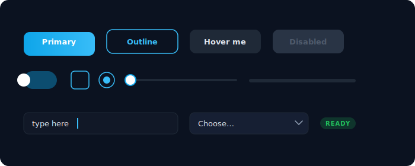
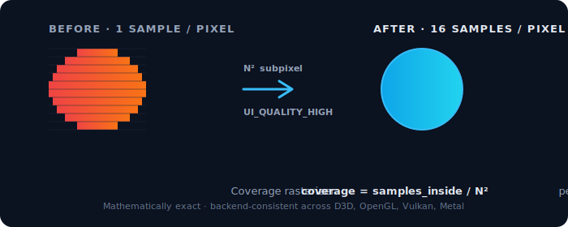

<div align="center">



<p>
  <a href="#building"></a>
  <a href="https://github.com/libsdl-org/SDL"></a>
  
  
  
</p>

<p>
  <b>A modular user interface toolkit in C</b>, built on top of
  <a href="https://github.com/libsdl-org/SDL"></a>
  with a focus on <b>visual quality</b>, <b>strict typing</b>, and a
  developer experience that doesn't get in the way.
</p>

</div>

---

## What's inside

- **Widgets that look right.** Rounded rectangles with analytic-coverage anti-aliasing, SDF-based drop shadows, configurable MSAA (1×/4×/16×/64× SPP), optional SSAA / FXAA / TAA on top.
- **A real component model.** Buttons, text, images, text fields/areas, tabs, dialogs, popups, dropdowns, sliders, switches, file drop zones, scroll views, grids, video, and an embedded WebView2 surface — all built around the same `UIWidget` envelope.
- **Built-in debug stack.** Logger with TCP/file/handler sinks · Chrome-Trace profiler · opt-in debug overlay — widget bounds + FPS/timing HUD + overdraw heatmap, toggled with F9 / F10 / F8 (F12 = all) · always-on crash handler with stack trace + widget-tree dump · optional ASAN/UBSAN.
- **Modern allocator.** Optional Microsoft [mimalloc](https://github.com/microsoft/mimalloc) plugged in transparently via `mocida_alloc.h`.
- **Themed C API.** Single header (`<uikit/app.h>`) re-exports the whole surface; consistent `UIType_Verb()` naming throughout.

---

## At a glance



<div align="center"><i>Buttons · controls · text inputs · dropdowns — all driven by the same `UIWidget` envelope.</i></div>

---

## Visual quality pipeline



The rasterizer computes per-pixel **coverage = samples_inside / N²** for circles and rounded corners, where N is `UI_QUALITY_{LOW,MEDIUM,HIGH,ULTRA}`. The output matches what hardware 16× or 64× MSAA would produce, is mathematically exact, and is **consistent across every backend** (D3D11, D3D12, OpenGL, Vulkan, Metal). On top of that you can stack:

- **SSAA 2× / 4×** — render at higher resolution, bilinear downscale on present.
- **FXAA** — CPU edge-detect + blur on the composed frame.
- **TAA** — per-pixel temporal accumulation with motion rejection (no ghosting).

Drop shadows are an SDF in one pass (`RasterizeShadowMask`); textures and shadows are cached by `(w, h, radius, blur, spread)` and re-colored at draw time via `SDL_SetTextureColorMod`, so changing color is free.

---

## Debug & profiling



```c
// One env var spawns a TCP debug stream — tail with `ncat 127.0.0.1 12345`.
//   set MOCIDA_DEBUG_PORT=12345
//   set MOCIDA_DEBUG_LEVEL=warn

UI_INFO (UI_CAT_CORE,   "app started (%dx%d)", w, h);
UI_WARN (UI_CAT_LAYOUT, "alignment target has no defined size");
UI_ERROR(UI_CAT_RENDER, "SDL_CreateRenderer error: %s", SDL_GetError());

UI_SCOPEC("layout_pass", UI_PROF_LAYOUT);   // adds to per-frame stats
UI_ASSERT(widget != NULL);                  // crash dump + abort on failure
UI_TRACK_ALLOC(UI_CAT_WIDGET);              // leak counter, per category

UIProfile_TraceStart(0);
// ... run the app ...
UIProfile_TraceSave("trace.json");          // open in chrome://tracing
```

The debug overlay is **opt-in** — enable it from your app, then toggle layers with the hotkeys:

```c
UIDebugOverlay_SetEnabled(1);                 // off by default
UIDebugOverlay_SetFlags(UI_OVERLAY_STATS);    // optional: start with a layer on
```

Once enabled: **F9** widget bounds · **F10** FPS/timing HUD · **F8** depth heatmap · **F12** toggle all. (F11 is deliberately avoided — it's the conventional fullscreen key.) While the overlay is disabled the keys pass straight through to your widgets, and it costs nothing. It works in Debug *and* Release builds.

Crashes (segfault, abort, divide-by-zero, …) write `mocida_crash_YYYYMMDD_HHMMSS.log` with a symbolicated backtrace + recent log lines + widget tree snapshot — wherever the process was running.

---

## Prerequisites

**OS** · Windows 10 (1809+) or Windows 11, **x64**. Most of the code is portable C11; only the WebView2 (`webview.c` + `webview_dcomp.cpp`) and Media Foundation (`video.c`) backends are Windows-only — every other widget builds without them in a future cross-platform port.

**Required at build time** — all installed automatically by `python setup.py` via [winget](https://learn.microsoft.com/windows/package-manager/), so you typically don't need to install anything by hand:

| Tool        | Why                                             | winget id                          |
|-------------|-------------------------------------------------|------------------------------------|
| Git         | Cloning SDL / mimalloc / vcpkg                  | `Git.Git`                          |
| CMake ≥ 3.11 | Build system                                    | `Kitware.CMake`                    |
| LLVM / clang| Default compiler (clang-cl mode)                | `LLVM.LLVM`                        |
| Ninja       | Fast generator (falls back to `make` if absent) | `Ninja-build.Ninja`                |
| Visual Studio Build Tools | MSVC CRT, Windows SDK headers       | `Microsoft.VisualStudio.2022.BuildTools` (workload: *Desktop development with C++*) |

If you'd rather skip `python setup.py`, make sure the executables above are on `PATH`, then run `python build.py` directly. The script auto-detects an existing vcpkg / mimalloc checkout and won't re-clone them.

**Required at runtime** — already on every supported Windows out of the box:

- **WebView2 Runtime** — ships with Windows 10 21H2+ and all Win11; auto-updated by Microsoft. Only used by `UIWebView`.
- **Media Foundation** + the codec packs Windows ships with — used by `UIVideo`. For HEVC playback specifically, install Microsoft's free [HEVC Video Extensions from Device Manufacturer](ms-windows-store://pdp/?productid=9n4wgh0z6vhq) once.

**Optional**:

| Tool      | What for                                                                | winget id                          |
|-----------|-------------------------------------------------------------------------|------------------------------------|
| Doxygen   | Generating the API docs (`python docs.py`)                                    | `DimitriVanHeesch.Doxygen`         |
| ffmpeg    | Synthesizing `sample.mp4` + `click.wav` for `test_video` / `test_sound` via `assets/make-samples.ps1` | `Gyan.FFmpeg` |
| Graphviz  | Class/include graphs in the docs (Doxygen calls `dot` if present)       | `Graphviz.Graphviz`                |
| RenderDoc | GPU frame capture against the lib                                       | `BaezonDev.RenderDoc`              |

**Disk** — a fresh clone + first `python setup.py` run pulls SDL/SDL_image/SDL_ttf + vcpkg + libcurl + WebView2 SDK + mimalloc, then builds everything. Reserve about **3–4 GB** total (vcpkg alone is ~2 GB once libcurl is built). Incremental rebuilds touch only `build\win32\` (or `build/linux`, `build/darwin`) and add ~200 MB.

**Hardware** — any 64-bit CPU with SSE2 and a GPU that supports one of D3D11 / D3D12 / OpenGL 3.3+ / Vulkan 1.1. The default renderer picks the best available driver at startup; you can override via `UIApp_SetRenderDriver`.

---

## Building

### First time on a fresh PC

```sh
python setup.py
```

Installs Git, CMake, LLVM/clang, Ninja, and Make via `winget` (skips what's already installed), bootstraps a local vcpkg, fetches libcurl + WebView2, clones SDL / SDL_image / SDL_ttf at pinned commits, then runs the first build for you.

### Day-to-day

The build scripts are plain Python 3 (`build.py`, `setup.py`, `release.py`,
`docs.py`) — the **same command works on Windows, Linux and macOS**:

```sh
python build.py                 # Debug, static lib, demo only (default flavour)
python build.py --clean         # wipe build/<platform>/<config> and reconfigure
python build.py --tests         # also compile every test_*
python release.py               # Release build + zipped distribution (Windows)
```

`python build.py` auto-detects MSVC (via `vswhere`) and imports `vcvarsall.bat x64` for you, so on Windows it works from any console — you don't need a "Developer Command Prompt for VS" first. On Linux / macOS (including WSL) it picks clang + Ninja automatically; output lands in `build/linux` or `build/darwin`. Per-platform subdirs let one checkout host parallel Windows + Linux builds without colliding (handy when WSL mounts the project at `/mnt/c/...`).

> Thin wrappers `build.ps1` (Windows) and `build.sh` (Unix) at the **monorepo root** forward to `build.py` if you prefer `.\build.ps1` / `./build.sh`.

### Build flavours

`python build.py` exposes three independent toggles. All flags are order-agnostic and compose freely:

| Flag           | What it does                                                                                          | Default |
|----------------|-------------------------------------------------------------------------------------------------------|---------|
| `--shared`     | Build `mocida.dll` instead of the static `mocida.lib`. Symbols are exported automatically via CMake's `WINDOWS_EXPORT_ALL_SYMBOLS` — no `__declspec` annotations needed in the source. The DLL is copied next to every executable in the build dir. | OFF (static) |
| `--tests`      | Compile every `tests/test_*.c` into its own `.exe` (35 focused visual scenarios — one per feature). Skipped by default to keep incremental rebuilds fast. | OFF |
| `--no-demo`    | Skip the showcase `demo.exe`. Useful when you only need the library.                                  | demo ON |
| `--clean`      | Drop `build\win32\` before configuring.                                                               | — |
| `--static`     | Force the static-lib flavour (overrides a previously cached `--shared`).                              | — |
| `--no-tests`   | Force tests OFF (overrides a previously cached `--tests`).                                            | — |

Common combinations:

```bat
python build.py                       :: static lib + demo (fastest, minimal)
python build.py --shared              :: mocida.dll + demo
python build.py --tests               :: static lib + demo + every test_*.exe
python build.py --clean --shared      :: from-scratch DLL build
python build.py --shared --no-demo    :: just the DLL — for embedding in your own project
python build.py --shared --tests      :: DLL + every test linked against it
```

The same options exist on the CMake side if you prefer driving it directly:

```bat
cmake -B build\win32 -DMOCIDA_BUILD_SHARED=ON -DMOCIDA_BUILD_TESTS=ON .
cmake --build build\win32 --parallel
```

### What lands in `build\win32\`

Output dirs are per-platform: `build\win32\` on Windows, `build/linux/` and `build/darwin/` on the respective Unix hosts (handled by `build.py`).

After a default build:

```
build\win32\
├── mocida.lib        :: static archive (static flavour)
└── demo.exe          :: showcase
```

After `--shared`:

```
build\win32\
├── mocida.dll        :: shared library
├── mocida.lib        :: import library (link against this)
├── demo.exe          :: small (~30 KB) — most code is in the DLL
├── SDL3.dll          :: copied automatically by post-build hooks
├── SDL3_ttf.dll
├── SDL3_image.dll
└── WebView2Loader.dll
```

After `--tests` you additionally get `test_button.exe`, `test_image.exe`, `test_shadows.exe`, `test_quality.exe`, `test_anchors.exe`, `test_textarea.exe`, … (one per file in `tests/`). Notable ones:

```bat
.\build\win32\demo.exe              :: drag + AA cycle + FPS toggle
.\build\win32\test_anchors.exe      :: alignment / anchor system live resize
.\build\win32\test_quality.exe      :: cycles MSAA LOW/MEDIUM/HIGH/ULTRA
.\build\win32\test_button.exe       :: interactive button states + click
.\build\win32\test_shadows.exe      :: SDF drop shadows
.\build\win32\test_image.exe        :: fill modes + tint
.\build\win32\test_video.exe        :: requires assets/sample.mp4 — see assets/README.md
.\build\win32\test_sound.exe        :: generates assets/click.wav on first run
```

### Consuming mocida in your own project

After building with `--shared`, link your app against the import library + ship the DLLs:

```cmake
# CMake (using mocida as a vendored/installed prebuilt)
target_include_directories(myapp PRIVATE path/to/mocida/src/headers)
target_link_libraries     (myapp PRIVATE path/to/mocida/build/win32/mocida.lib)
# At runtime, mocida.dll + SDL3*.dll + WebView2Loader.dll must sit next to myapp.exe
```

Or build mocida as a static library (default) and link directly — no DLL to ship, larger executable.

### Optional sanitizers (clang / gcc only)

```bat
cmake -B build -DMOCIDA_SANITIZE=address ..
cmake -B build -DMOCIDA_SANITIZE=address,undefined ..
cmake --build build --parallel
```

Catches use-after-free, double-free, leaks (with `ASAN_OPTIONS=detect_leaks=1`), signed/unsigned overflow, and bad shifts. Not for production binaries — they slow the runtime down 2-3×.

### Picking a render driver

The default render driver is auto-selected (D3D12 on Windows 10+/11, D3D11 fallback). Override at startup:

```c
UIApp_SetRenderDriver(app, UI_RENDER_OPENGL);  // or UI_RENDER_VULKAN, UI_RENDER_3D11, ...
```

See the comment block in `src/headers/uikit/app.h:37` for the full list.

---

## Hello, world

```c
#include <uikit/app.h>

int main(void) {
    UIApp* app = UIApp_Create("My app", 800, 600);

    UIApp_SetWindowIcon(app, "assets/logo.svg");
    UISearchFonts();

    UIChildren* children = UIChildren_Create(8);

    UIButton* btn = UIButton_Create("Click me", 22.0f);
    UIButton_SetFontFamily(btn, UIGetFont("Arial"));
    UIButton_SetRadius   (btn, 8.0f);
    UIButton_SetShadow   (btn, UI_SHADOW_DEFAULT);

    UIWidget* w = widgcs(btn, 220.0f, 56.0f);
    UIWidget_SetPosition(w, 290.0f, 270.0f);
    UIChildren_Add(children, w);

    UIApp_SetChildren       (app, children);
    UIApp_SetBackgroundColor(app, (UIColor){ 248, 250, 252, 1.0f });

    UIApp_ShowWindow(app);
    UIApp_Run       (app);
    UIApp_Destroy   (app);
    return 0;
}
```

---

## Documentation

The full API reference is generated by Doxygen and lives under `docs/generated/html/`.

```bat
python docs.py                     :: build only
python docs.py --open              :: build + open the index in your browser
python docs.py --serve             :: build + start a local HTTP server (default :8080)
python docs.py --serve --port 4242 :: pick another port
python docs.py --serve --no-build  :: just serve what's already there
```

`--serve` uses a native PowerShell HttpListener — no Python, Node, or extra tooling needed. The site supports **light / dark / auto** themes; click the moon/sun icon next to the logo to cycle. Your preference is remembered across reloads.

---

## Layout of the repo

```
src/
├─ headers/uikit/    public C headers — include via <uikit/app.h>
└─ uikit/            implementation (.c + .cpp for WebView2/DComp glue)

tests/               one .c per visual feature; each builds to its own .exe
assets/              logo, SVG showcases, optional media for tests (sample.mp4 etc)
docs/                Doxyfile, mainpage.md, custom theme
SDL/, SDL_image/, SDL_ttf/   vendored at pinned commits (see python setup.py)
mimalloc/            optional allocator (auto-detected by CMake)
vcpkg/               local toolchain bootstrap for libcurl + webview2
```

---

## Roadmap

- [x] Widget primitives (rect, text, image, button)
- [x] Form controls (textfield, textarea, checkbox, switch, radio, slider, progress)
- [x] Layout containers (stack, grid, scroll, tabview, dialog, popup)
- [x] Animations (tweens with easing curves)
- [x] Media (UIVideo via Media Foundation, UISound via SDL audio)
- [x] WebView (Edge Chromium via WebView2)
- [x] Debug toolkit (logger, profiler, overlay, crash handler, ASAN/UBSAN)
- [ ] Live tweak protocol (bidirectional debug TCP)
- [ ] Inspector tree dump as JSON
- [ ] Cross-platform port (Linux/macOS audio + video backends)

---

## License

MIT. See [`LICENSE`](LICENSE) for details. SDL / SDL_image / SDL_ttf are vendored under their respective zlib licenses; mimalloc is MIT.
